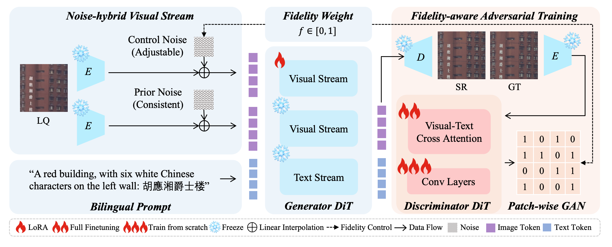
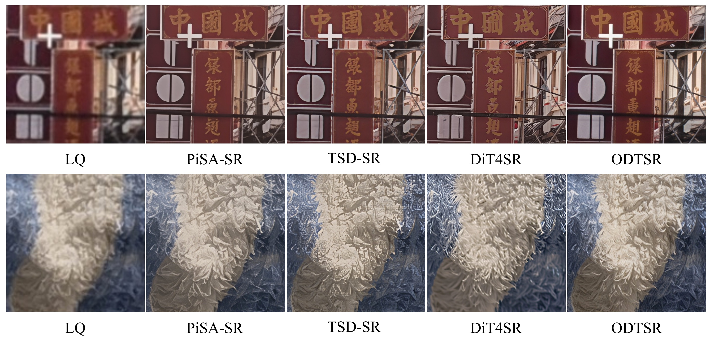
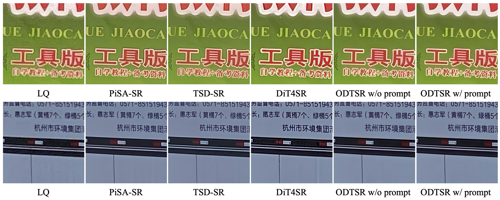
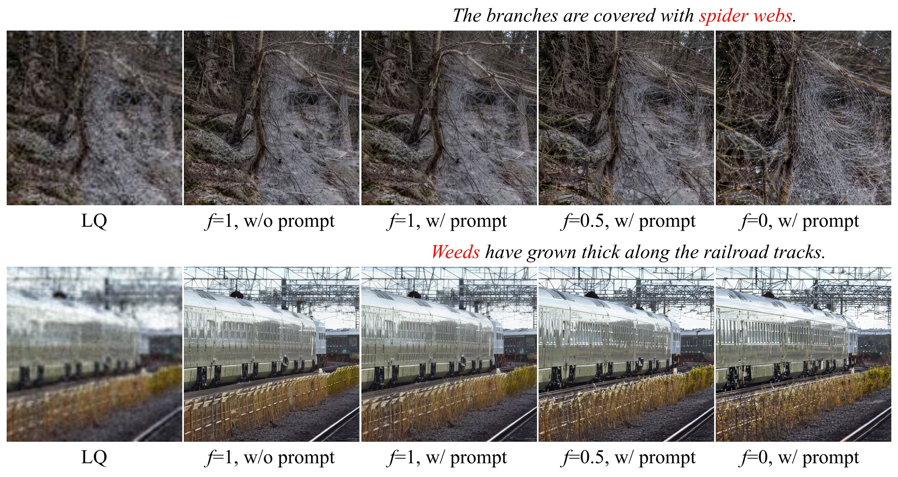
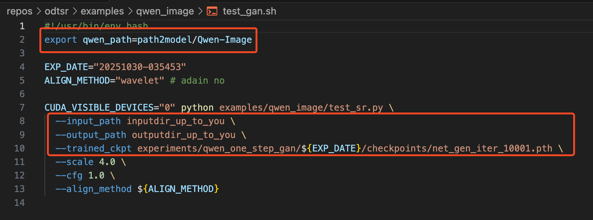
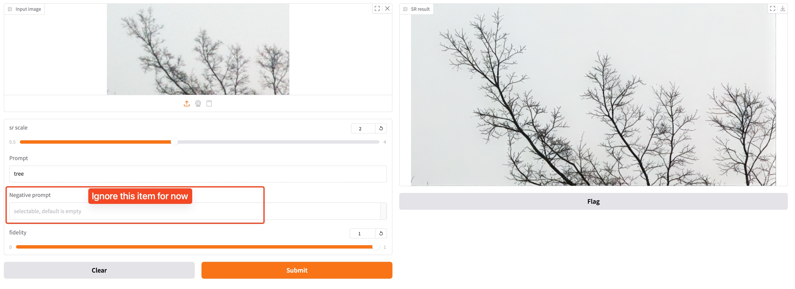

<div align="center">
<h2>One-Step Diffusion Transformer for
Controllable Real-World Image Super-Resolution</h2>


<a href='https://arxiv.org/abs/2511.17138'></a>


Yushun Fang<sup>1,2,\*</sup>&nbsp;&nbsp;&nbsp;&nbsp;Yuxiang Chen<sup>2,\*</sup>&nbsp;&nbsp;&nbsp;&nbsp;Shibo Yin<sup>2,†</sup>&nbsp;&nbsp;&nbsp;&nbsp;Qiang Hu<sup>1,†</sup>&nbsp;&nbsp;&nbsp;&nbsp;Jiangchao Yao<sup>1</sup>  
Ya Zhang<sup>1</sup>&nbsp;&nbsp;&nbsp;&nbsp;Xiaoyun Zhang<sup>1,†</sup>&nbsp;&nbsp;&nbsp;&nbsp;Yanfeng Wang<sup>1</sup>  
<sup>1</sup>Shanghai Jiao Tong University&nbsp;&nbsp;&nbsp;&nbsp;<sup>2</sup>Xiaohongshu Inc  
<sup>\*</sup>Equal contribution&nbsp;&nbsp;&nbsp;&nbsp;<sup>†</sup>Corresponding author
</div>


## ⏰ Update
- **2025.11.25**: The paper (including supplementary materials) is released on [arXiv](https://arxiv.org/abs/2511.17138).
- **2025.11.21**: Code is released.


:star: If ODTSR is helpful to you, please help star this repo. Thanks! 

## 🌟 Overview Framework
<div align="center">
  
</div>

1. Based on Qwen-Image, we train a **single-step** SR model using LoRA, with the model parameters reaching 20B.  
2. With our proposed Noise-hybrid Visual Stream and Fidelity-aware Adversarial Training, the SR process can be jointly controlled by prompts as well as a Fidelity Weight $f$.
3. English and Chinese prompts are supported, and the model demonstrates strong performance in text images, fine-grained textures and face images.


## 😍 Visual Results
### Results with fixed prompts & high fidelity
<div align="center">
  
</div>

Under the high-fidelity setting with a fixed prompt, our model produces restorations that adhere more closely to the LQ input while remaining natural, significantly reducing the sense of AI processing.
### Text Real-ISR Results
<div align="center">
  
</div>
In text scenarios, when the prompt specifies the text to be restored, the model automatically matches the LQ text and performs the restoration.

### Controllable Real-ISR Results
<div align="center">
  
</div>


Qualitative results of controllable SR with prompt and adjustable Fidelity Weight (denoted as $f$) on Div2k-val
dataset. As $f$ decreases from 1 to 0, detail generation and prompt adherence gradually strengthen.


## ⚙ Dependencies and Installation

1. Prepare conda env:
```
conda create -n yourenv python=3.11
```
2. Install ``pytorch`` (we recommend ``torch==2.6.0``):
```
pip install torch==2.6.0 torchvision==0.21.0 torchaudio==2.6.0  -f https://mirrors.aliyun.com/pytorch-wheels/cu124/
```
3. Install this repo (based on [DiffSynth-Studio](https://github.com/modelscope/DiffSynth-Studio/tree/main)). The required packages will be automatically installed:
```
cd xxxx/ODTSR
pip3 install -e . -v  -i https://mirrors.cloud.tencent.com/pypi/simple
```


4. (For training) Install ``basicsr``:
```
pip install basicsr
```
Note:
You can apply the the following command to fix a bug in ``basicsr``. Make sure to replace ``/opt/conda`` with the path to your own conda environment:
```
sed -i '8s/from torchvision.transforms.functional_tensor import rgb_to_grayscale/from torchvision.transforms._functional_tensor import rgb_to_grayscale/' /opt/conda/lib/python3.11/site-packages/basicsr/data/degradations.py
```


5. Download base model to your disk: [Qwen-Image](https://huggingface.co/Qwen/Qwen-Image/tree/main)

6. (For training) Download base model to your disk: [Wan2.1-T2V-1.3B](https://huggingface.co/Wan-AI/Wan2.1-T2V-1.3B/tree/main) 


## 🍭 Inference with script
> Note: you need at least 40GB GPU memory to infer. We will support CPU offload to reduce GPU memory usage soon.

> We now supports tile-based processing (tile size: 512×512), enabling input of arbitrary resolutions and SR at any scale factor.
```
sh examples/qwen_image/test_gan.sh
```
<div align="center">
  
</div>

## 🎦 Inference with gradio

```
sh examples/qwen_image/test_gradio.sh
```


## 🔥 Training

To be updated.


## License
This project is released under the [Apache 2.0 license](LICENSE).

## Acknowledgement
This project is based on [DiffSynth-Studio](https://github.com/modelscope/DiffSynth-Studio/tree/main).
We also leveraged some of [PiSA-SR](https://github.com/csslc/PiSA-SR/tree/main)'s code in dataloader part.
Thanks for the awesome work!
